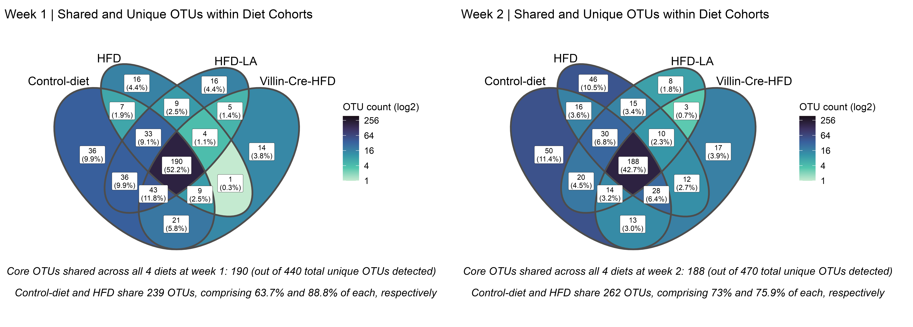
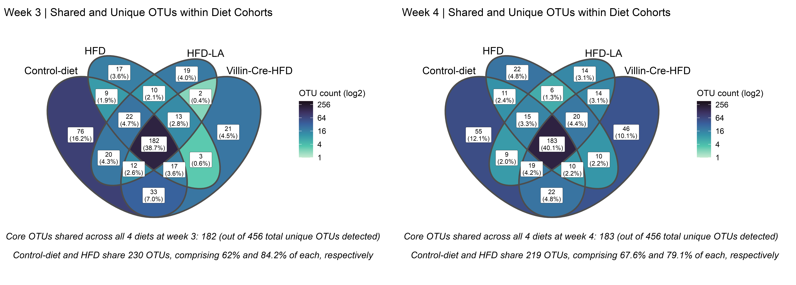
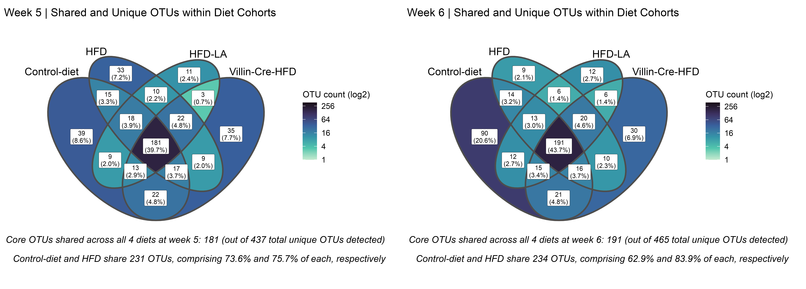
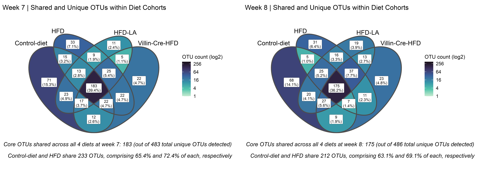
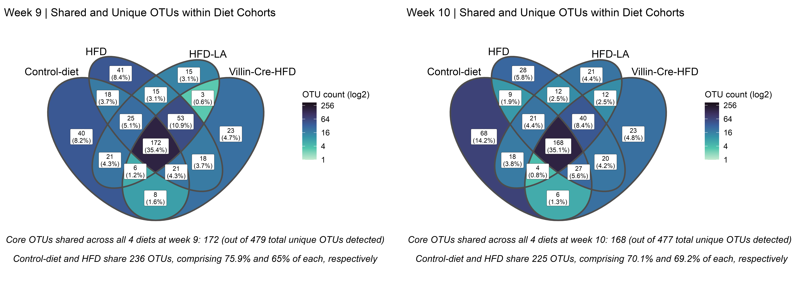
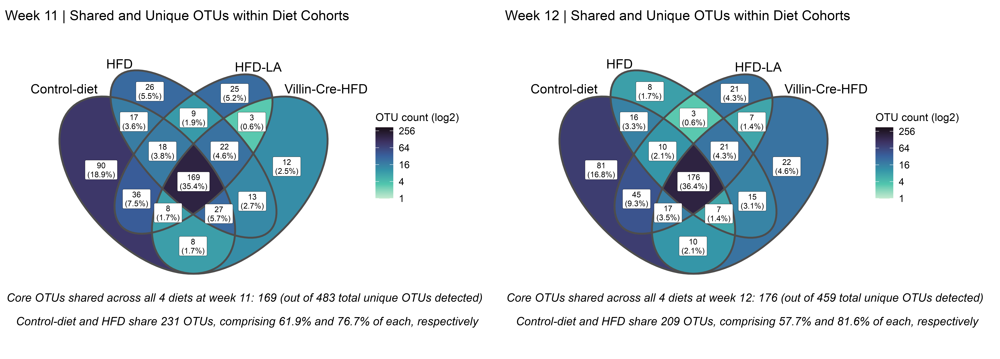
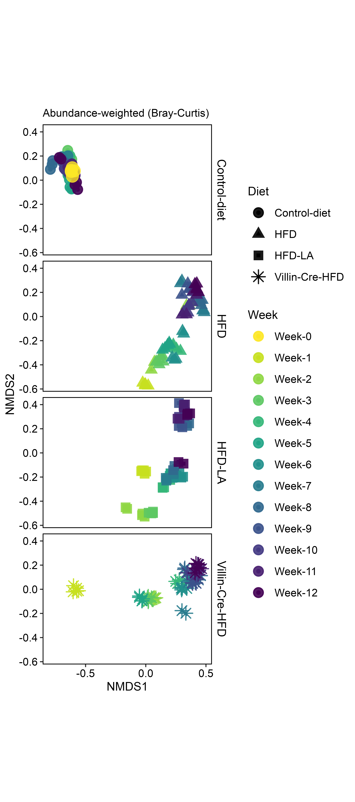
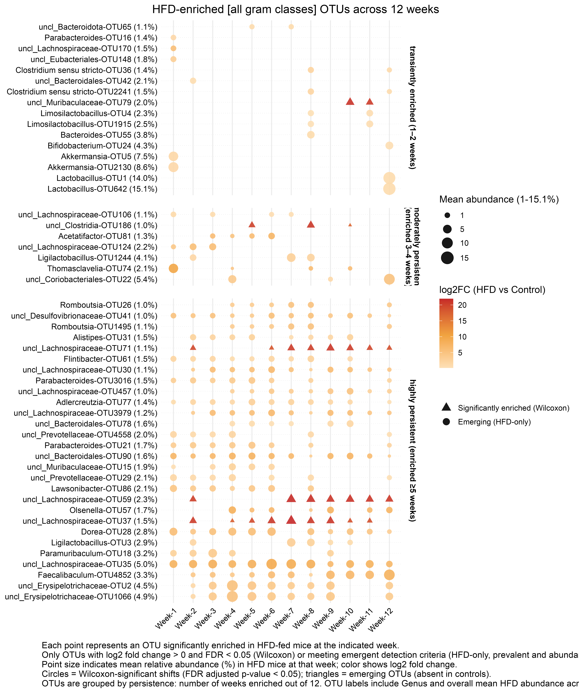

\

::: homelink
<a href="https://kellifeeser.github.io/hfd-microbiome/index.html" target="_blank" style="text-align:right">Back to Home</a>
:::

\

------------------------------------------------------------------------

Document last updated: 2025-04-15

------------------------------------------------------------------------

\

# Set-up {.unlisted .unnumbered .hidden}

## load packages

## load cache

## load rds

## set colors shapes

# Methods

## DNA extraction and amplicon sequencing

We extracted and sequenced DNA from a total of 245 samples, comprised of 5 random stool samples from before the experimental diets began (referred to as Day 0 or Week 0), while all mice were fed the their standard "Control-diet", and then weekly collections of 5 random stool samples per cohort over the next 12 weeks (5 replicates x 4 cohorts x 12 weeks). DNA extractions were performed using []. Taxonomic profiling was performed by sequencing bacterial 16S rRNA genes. The V3-V4 region of bacterial (and archaeal) 16S rRNA genes was amplified using primers 515f-R806 (Bates et al., 2010). PCR amplifications were performed using previously described methods (Mueller et al., 2016). In the first PCR, sample barcoding was performed with forward and reverse primers each containing a 6-bp barcode; 22 cycles with an annealing temperature of 60oC were performed. The second PCR added Illumina adaptors over 10 cycles with an annealing temperature of 65°C. Amplicon clean-up was performed with a 0.9 ratio of AMPure XP beads (Beckman Coulter, Indianapolis IN), following manufacturer’s instructions and final elutions were performed with 30µl Elution Buffer. Following clean-up, samples were quantified with an Invitrogen Quant-iTTM ds DNA Assay Kit on a BioTek Synergy HI Hybrid Reader and pooled at a concentration of 10 ng per sample. A final clean-up step was performed on pooled samples using a 0.9 ratio of AMPure XP beads. Samples were sequenced on an Illumina MiSeq platform with PE250 chemistry at Los Alamos National Laboratory. Unprocessed sequences are available through NCBI’s Sequence Read Archive ().

## Microbial community sequence analysis

Bacterial sequences were processed using Usearch11 (Edgar, 2010). Samples were demultiplexed, paired ends merged, quality filtered and globally trimmed using a fastq_maxee threshold of 1.0 (Edgar and Flyvbjerg, 2015), dereplicated, and singletons were removed. Chimeras were removed and 97% OTU clustering was performed independently for the two datasets with the -cluster_otus command using the UPARSE-OTU algorithm (Edgar, 2013). Previous analyses have shown congruent ecological patterns with use of OTUs versus exact sequence variants (ESVs) for delineating microbial taxa (92). OTU tables were created using the -otutab command. Bacterial OTUs were classified using the Ribosomal Database Project (RDP) classifier v.19 (Wang et al., 2007). Next-generation sequencing of 16S rRNA genes resulted in 5,043,233 reads (average of 20,585 ± 3,467 (SD) reads per sample, n = 245 samples). These reads yielded 1,090 OTUs. Domain-level analyses revealed that 99.99% of reads were classified as “Bacteria”, 0.003% as “Eukaryota”, and 0.01% were unclassified at the domain level. The dataset was then filtered to exclude all domains except Bacteria, all reads assigned at \>= 80% confidence at the phylum-level (n = 12,991), reads assigned to the class Chloroplast (n = 122), and the remaining singleton reads (n = 32). We rarefied via subsampling without replacement to 13,006 sequences per sample to account for uneven sequencing depth and from that, 624 bacterial OTUs (97% sequence similarity) were identified from 243 samples.

[Phylum]/[Class]/[Order]/[Family]/[Genus]-level bar plots of the community profiles by week along the 12 week longitudinal can be found in SI Figures XYZ (or here: [Taxonomy].\

## Statistical analysis

Microbial community analyses were conducted primarily in the vegan (Oksanen et al., 2018) and phyloseq (McMurdie and Holmes, 2013) packages in the R programming environment unless otherwise noted. Patterns in microbial community composition were visualized using non-metric multidimensional scaling (NMDS) using Bray-Curtis (abundance-weighted) and Jaccard (binary presence/absence) distance metrics.\

We investigated the degree to which differences in microbial community profiles were explained by experimental factors ....\

We also examined differences across initial ...\

### Week-0 baseline characterization

To quantify inter-individual variability prior to dietary intervention, we analyzed five stool samples collected at baseline (Week-0), before diet assignment. Alpha diversity was measured using both observed OTU richness and Shannon entropy. Taxonomic profiles were summarized at the family level using relative abundance from a transformed OTU table. Pairwise Bray–Curtis dissimilarities were computed to assess baseline community divergence. Additionally, we calculated distances to the group centroid using PERMDISP to quantify β-dispersion. These metrics were used to establish the null range of baseline variation, providing an ecological benchmark against which subsequent compositional shifts were interpreted.\

### Multi-site (sample) dissimilarity partitioning

Using the R package betapart (v1.6), we computed the 3 abundance-based multiple-site dissimilarities (balanced variation fraction,abundance-gradient fraction, and overall dissimilarity) using the Bray-Curtis family of dissimilarity indices, in addition to the corresponding presence/absence-based multiple-site dissimilarities accounting for the spatial turnover and the nestedness components of beta diversity, and the sum of both values using beta.multi(index.family = sorensen"). To compute abundance-based beta diversity, we used unrarefied OTU tables to retain quantitative abundance information. Rarefaction can eliminate natural abundance gradients, resulting in inflated balanced dissimilarity and zero-valued gradient components in Bray-Curtis partitioning (Baselga 2017). We therefore retained untransformed counts for βBRAY partitioning, and only applied rarefied tables for presence/absence-based analyses (e.g., βSOR).\

The statistical significance of these explanatory experimental factors was assessed using adonis2(), a function based on permANOVA, within the vegan R-package (McArdle and Anderson, 2001). Adonis is a permutational (n = 999) multivariate analysis of variance test that partitions our Bray-Curtis distance matrices among sources of variation (Anderson, 2001).\

The distinctness of the ... communities was assessed using the Random Forests classification algorithm (Breiman, 2001), using 1000 trees. As implemented in the R package ‘randomForest’, the algorithm constructs each tree using a different bootstrap sample from the original data (approximately 1/3 of the cases are left out of the bootstrap sample and not used in the construction of the kth tree), thus providing an unbiased estimate of the test set error without the need for separate cross-validation test.\
\

# Introduction

Nonalcoholic fatty liver disease (NAFLD) is a rapidly growing global health concern and the most common cause of chronic liver disease worldwide. Its prevalence has risen in parallel with obesity, type 2 diabetes, and metabolic syndrome, and it now affects nearly one in three adults globally. NAFLD encompasses a spectrum of liver pathology, ranging from simple steatosis to nonalcoholic steatohepatitis (NASH), fibrosis, cirrhosis, and hepatocellular carcinoma. Despite extensive efforts, there are currently no approved pharmacologic therapies for NAFLD, and clinical management remains limited to diet and lifestyle modification.

Over the past decade, the gut microbiota has emerged as a critical regulator of host metabolism and a central player in NAFLD pathogenesis. The gut-liver axis—a bidirectional communication pathway linking the intestinal microbiota and the liver via the portal circulation—enables microbial metabolites, antigens, and endotoxins to directly influence hepatic physiology and immune responses (Li et al., 2017). Perturbations in this axis, particularly those arising from gut microbial dysbiosis and impaired intestinal barrier function, are increasingly recognized as upstream drivers of liver disease.

A growing body of evidence implicates increased intestinal permeability (IP) and the translocation of microbial products, especially lipopolysaccharide (LPS) from Gram-negative bacteria, as key mediators of HFD-induced liver pathology (Ciaula et al., 2020). Elevated LPS levels activate Toll-like receptor 4 (TLR4) on hepatic immune and parenchymal cells, triggering MyD88-dependent inflammatory signaling cascades that promote the production of pro-inflammatory cytokines such as TNF-α and IL-6, thereby exacerbating hepatic steatosis and injury. Importantly, these events are initiated at the level of the intestinal epithelial tight junction (TJ) barrier, whose disruption facilitates microbial translocation and systemic endotoxemia.

Although the association between NAFLD and increased intestinal permeability is well documented, a critical gap in mechanistic understanding remains. Specifically, it is unclear whether a defective intestinal TJ barrier is simply a consequence of liver inflammation or a primary pathogenic factor in NAFLD development. Furthermore, the molecular mechanisms by which HFD induces barrier dysfunction—and whether this process can be therapeutically targeted—remain incompletely defined.

To address these fundamental questions, we investigate the hypothesis that HFD-induced increase in intestinal permeability is a sine qua non pathogenic driver of NAFLD, and that targeted modulation of the intestinal TJ barrier can prevent or reverse liver disease. Our preliminary studies support this model by demonstrating that:
(1) increased IP is required for both hepatic steatosis and inflammation,
(2) HFD consumption leads to a rapid rise in gut-derived LPS,
(3) the LPS-TLR4 signaling axis is essential for both IP and NAFLD development, and
(4) HFD upregulates myosin light chain kinase (MLCK), a key effector of TJ regulation, which mediates barrier dysfunction and liver injury.

Strikingly, we also observed that molecular targeting of the intestinal TJ barrier via the probiotic Lactobacillus acidophilus LA1 suppressed MLCK activation, preserved TJ integrity, and prevented disease progression. These findings suggest that probiotic-driven modulation of host-microbiota interactions at the epithelial interface offers a novel therapeutic avenue for the treatment of NAFLD.

To test these mechanistic hypotheses, we employed a controlled experimental design comprising four mouse cohorts:
(1) control-diet-fed mice,
(2) wild-type mice fed a high-fat diet (HFD),
(3) HFD-fed wild-type mice supplemented with L. acidophilus LA1 (HFD-LA1), and
(4) HFD-fed Villin-Cre TLR4/MyD88-deficient mice with impaired epithelial innate immune signaling.
This approach allows us to dissect the individual and combined contributions of diet, microbiota, and host immune sensing to the breakdown of intestinal barrier function and the development of NAFLD.

By integrating microbiome analysis with host immune and epithelial phenotyping, our study aims to clarify the causal role of the intestinal barrier in HFD-induced NAFLD and to explore whether therapeutic strengthening of this barrier represents a viable strategy to halt or reverse disease progression.\
\

## hidden {.hidden .unnumbered .unlisted}

[note:I know intros don't use subheaders, these are just for organization]

**Microbiota–Diet Interactions in NAFLD Pathogenesis** Non-alcoholic fatty liver disease (NAFLD) is a leading cause of chronic liver disease globally, strongly associated with dietary patterns, particularly excessive intake of high-fat diets (HFDs). Numerous clinical and preclinical studies have identified shifts in gut microbiota composition during NAFLD development, implicating the microbiome as a mediator of metabolic dysregulation, hepatic steatosis, and inflammation. Experimental evidence supports roles for microbially derived metabolites—including short-chain fatty acids, secondary bile acids, and endotoxins—in promoting liver fat accumulation, disrupting immune signaling, and modulating systemic insulin sensitivity.

Microbia contribute fundamentally to host metabolism, immune development, and ecological resilience. [A substantial body of work demonstrates that species richness (α-diversity) influences these outcomes, yet variation or dissimilarity between communities (β-diversity)... - might reposition this part]

In an effort to delineate the microbial contributions to NAFLD, many(?) studies have sought to identify specific taxa associated with disease severity or progression. However, this taxon-centric approach faces several inherent limitations. First, the gut microbiome functions as a complex, interdependent community, where species do not act in isolation but instead participate in collective metabolic networks and ecological interactions. Second, taxonomic resolution in amplicon-based profiling is often insufficient to capture strain-level variation that may drive host outcomes. Finally, inter-individual variability and high-dimensional sparsity limit the reproducibility and interpretability of taxon-level associations, particularly in small or heterogeneous cohorts.

As a result, relatively little is known about the community-level principles that govern microbiota restructuring during chronic dietary perturbation. In particular, the ecological processes underlying microbial community divergence across diets and over time remain poorly defined. Without this understanding, it is difficult to distinguish between deterministic patterns of microbial selection (e.g., driven by nutrient availability or host immune tone) and stochastic community drift. This gap limits our ability to generalize microbial signatures of disease or therapeutic response across models and populations.\

**Community Dissimilarity as a [~~Mechanistic~~] Lens on Microbial Assembly and Function (if there is a story here)** Gut microbiota contribute fundamentally to host metabolism, immune calibration, nutrient processing, and epithelial barrier integrity. These functions are not only shaped by microbial taxonomic composition but also by emergent properties of community structure and assembly. A substantial body of work demonstrates that within-sample diversity (α-diversity) correlates with microbial richness, metabolic flexibility, and functional potential. However, a growing body of theory and empirical evidence increasingly recognizes that variation between communities—β-diversity—is an equally critical determinant of system-level resilience, responsiveness, and ecological function (@Mori2018). Moreover, [it is a more?] biologically-meaningful dimension of microbiome [variation]...

In both natural ecosystems and host-associated microbiotas, β-diversity captures how communities differ—in composition, structure, and inferred function—across space, time, or treatment. This inter-sample variation plays a central role in shaping not only which functions are present, but how they are distributed, and whether they are redundant or complementary across systems. In the context of complex diseases such as non-alcoholic fatty liver disease (NAFLD), it is increasingly evident that microbial community composition varies substantially between individuals even under identical genetic and dietary backgrounds, and that this variation may modulate host susceptibility to metabolic dysfunction.

Community dissimilarity, often quantified using Bray–Curtis or Sørensen metrics, reflects the cumulative effects of compositional turnover, richness differences, and abundance shifts among samples. Partitioning these dissimilarities into ecologically interpretable components enables inference about whether observed changes reflect species replacement (turnover), nested loss of taxa, or shifts in relative abundance/dominance hierarchies. This approach provides a framework for understanding the ecological processes underlying microbial community assembly, including deterministic filtering, stochastic drift, and priority effects, and for interpreting how these processes contribute to microbial restructuring under dietary perturbation.

Ecological theory frames β-diversity as the product of community assembly mechanisms, including deterministic filtering (e.g., diet, inflammation), stochastic drift, dispersal limitation, and priority effects. Distinguishing between these processes is particularly critical in microbiome research, where high inter-individual variability is often mischaracterized as “noise,” rather than the output of structured, ecological rules.

By decomposing β-diversity into interpretable ecological components—such as turnover vs. nestedness for presence–absence data, or balanced variation vs. abundance gradients for count-based measures—we can infer whether microbial community differences reflect species replacement, richness loss, or shifts in dominance hierarchies (@Mori2018). In the context of NAFLD, where diet is both a modifier of microbial composition and a driver of hepatic injury, these distinctions can help link microbial change to functional outcomes.

This approach provides a direct, process-based means of interrogating community assembly mechanisms. For instance, increasing turnover within or between groups may signal deterministic filtering (e.g., by diet), while reduced dissimilarity across timepoints may reflect convergence or biotic homogenization. Applying this framework to host-associated microbial communities allows us to evaluate how community divergence unfolds across time or under intervention, and whether this restructuring aligns with disease trajectories or recovery.

**Community-Level Variation and Functional Consequences** Recent advances in biodiversity–ecosystem function (BEF) theory emphasize that no single microbial community can support all ecosystem or host functions simultaneously. Rather, functional multifunctionality—the simultaneous maintenance of multiple beneficial functions—requires heterogeneous communities, each supporting different but complementary functional capacities. This model implies that high β-diversity, particularly across individuals exposed to different perturbations (e.g., high-fat diets), is essential for maintaining system-level functional capacity.

In host-associated systems, the relevance of β-diversity becomes particularly acute under perturbations such as dietary shifts, which act as strong environmental filters. Under these conditions, community convergence (low β-diversity) may signal functional homogenization, potentially constraining host adaptation, resilience, or therapeutic responsiveness. Conversely, sustained or increasing β-diversity may reflect adaptive diversification or ecological succession, potentially supporting functional insurance in the face of metabolic stress.

Notably, @Mori2018 argue that β-diversity not only reflects variation in function, but also links the causes and consequences of biodiversity change by embedding diversity patterns within the processes of community assembly and the provisioning of ecosystem services. This framework is particularly compelling in the gut–liver axis, where microbial metabolism directly influences lipid accumulation, inflammation, and fibrosis—hallmarks of NAFLD progression.

[alt: A growing body of ecological theory argues that no single microbial community can support all host functions at maximal efficiency, particularly in complex or perturbed systems. Instead, functional complementarity across communities—enabled by taxonomic variation and niche partitioning—is required to maintain broader system-level resilience and functional capacity. From this perspective, inter-individual variation in microbiome composition (i.e., high community dissimilarity) may be functionally beneficial, particularly when paired with overlapping or redundant core functions.

In contrast, community convergence—for instance, under the influence of a high-fat diet—may constrain the range of available microbial functions, reduce redundancy, and increase susceptibility to perturbation. These concepts are well-established in environmental microbiology and are now being applied to host-associated systems, where microbial community structure is increasingly understood as both a consequence and a driver of host phenotype. In NAFLD, this may be particularly relevant, as early microbial shifts may precede or amplify downstream metabolic or immunologic dysfunction. ]\

**Aims** In the context of HFD-induced NAFLD, we hypothesize that diet cohorts will diverge compositionally over time via deterministic filtering, and that such divergence can be parsed into distinct ecological components (species turnover, nestedness, abundance gradients). These patterns may predict microbiome-driven variation in HOST PHENOTYPE.

In this study, we investigate how gut microbial communities respond to long-term dietary intervention in a murine model of NAFLD [+ HFD-LA + knockout mice]. We collected weekly stool samples across a 12-week time series, encompassing a shared initial community (Week 0) and divergent dietary exposures thereafter. All mice began with the same baseline control-diet, then transitioned to one of four diets: a standard control or one of three high-fat diets differing in composition or host background. Stool samples were collected weekly for 12 weeks, enabling temporal profiling of microbial dynamics.

To interrogate patterns of microbial divergence, we applied ecological partitioning of β-diversity, using both presence/absence-based (Sorensen) and abundance-based (Bray-Curtis) frameworks. By decomposing these into turnover vs. nestedness and balanced variation vs. gradient components, respectively, we aim to address the following questions:

~~We applied both presence–absence and abundance-based dissimilarity metrics to quantify divergence in microbial communities over time. By decomposing microbial community dissimilarity into interpretable and ecologically meaningful components: turnover and nestedness for presence/absence (Sørensen) and balanced and gradient components for abundance (Bray–Curtis),~~ we aimed to address the following questions:

-   To what extent do microbial communities diverge over time within and between diet cohorts?

-   Are these changes driven predominantly by species replacement, loss of richness, or abundance shifts?

-   Do high-fat diets induce deterministic filtering and convergence across replicates, or preserve individualized community trajectories?

-   Can these patterns of community dissimilarity inform future efforts to modulate the microbiome in NAFLD?

[*alt: **Aims:** Determine how microbial communities diverge over time and across distinct high-fat and control diets using β-diversity partitioning.*

*Link microbial community assembly processes (e.g., deterministic filtering vs. stochastic drift) to specific dietary interventions and host metabolic states.*

*Evaluate temporal dynamics of β-diversity (turnover, nestedness, Bray partitions) to infer successional patterns or biotic homogenization associated with NAFLD development.*

*Ultimately, connect microbial compositional divergence to functional potential and host phenotype trajectories (e.g., liver histology, metabolic markers, inflammation).*]

This approach enables us to interpret compositional change not merely as a shift in taxa, but as the emergent outcome of ecological processes. By integrating ecological theory with longitudinal microbiome profiling, this study provides a [~~mechanistic~~] foundation for understanding how diet-induced microbial restructuring unfolds at the community level—and how these changes may contribute to metabolic disease progression or resilience. [prior to this work in expectations/hypotheses relevant to LA and knockout mice]

------------------------------------------------------------------------

# Results

\

We first used a community ecology framework to assess ... Our [analytical aims] were 1) characterize the baseline community variation ... 2) assess temporal trajecories within and among diet cohorts 3) build off the previous to narrow in on key HFD-driven, temporally-relevant, perburations in community structure. By partitioning community dissimilarity [... explain betapart rationale] ... Following @Mori2018, we treat β-diversity not just as a pattern, but as a mechanistic lens to infer how microbial community assembly processes shape functional outcomes under ...diets... over time.”

## Research Question 1: What is the magnitude and nature of baseline variation? [A: relatively stable and species-rich?]

Sections goals:

-   Understand the baseline heterogeneity among starting microbiomes before dietary intervention. / Establish baseline expectations [~~null model for future divergence comparisons.~~]
-   Find shared and unique OTUs among week 0 samples, compare with community membership across study period
-   Identify range of dissimilarity, dominant mechanisms (turnover vs nestedness).
-   Find any anomalous [pairwise?] outliers.

the baseline compositional heterogeneity (or lack thereof) among samples that began with identical conditions.

This is important because: - It defines how much divergence we expect by chance or stochasticity - allows us to say later, “This diet/timepoint exceeded initial inter-individual variability” - It gives us a framework to talk about assembly (even at T0)\
\

### Characterizing Day 0 Communities

-   Add stability of control diet over time

-   consider all control-diet OTUs

<!-- -->

\
\

*Comparing to full dataset/across all weeks*

The initial/starting communities (n = 5) contained over half of all of the OTUs detected across the whole dataset (364 of the total 624 OTUs, or 58.3%). Each of the 5 random Week-0 stool samples were comprised of 301 to 311 OTUs.

Families Turicibacteraceae and Rikenellaceae and genera Alistipes, Duncaniella (G-), Limosilactobacillus, and Turicibacter were top 10 for Week-0, but not whole dataset. Conversely, Bacteroidaceae and Bifidobacteriaceae were not in the top 10 families for Week-0, nor were Bifidobacterium, Faecalibaculumm, uncl_Erysipelotrichaceae, or uncl_Oscillospiraceae in the top 10 genera for Week-0.

-   About *Duncaniella*: - "We performed a large-scale experiment using 579 genetically identical laboratory mice from a single animal facility, designed to identify the causes of disease variability in the widely used dextran sulphate sodium mouse model of inflammatory bowel disease. Commonly used treatment endpoint measures—weight loss and intestinal pathology—showed limited correlation and varied across mouse lineages. Analysis of the gut microbiome, coupled with machine learning and targeted anaerobic culturing, identified and isolated two previously undescribed species, Duncaniella muricolitica and Alistipes okayasuensis, and demonstrated that they exert dominant effects in the dextran sulphate sodium model leading to variable treatment endpoint measures. We show that the identified gut microbial species are common, but not ubiquitous, in mouse facilities around the world, and suggest that researchers monitor for these species to provide experimental design opportunities for improved mouse models of human intestinal diseases." (@Forster2022)

#### [Dissimilarity Partitioning...]

These communities had an overall abundance-based multiple-site dissimilarity of 0.175 (`betapart::beta.multi.abund()`) and a presence/absence-based total multiple-site dissimilarity of 0.204 (`betapart::beta.multi()`). The turnover or species replacement component, measured as the Simpson dissimilarity, represented 93.99% of the total presence/absence-based dissimilarity. Pairwise comparisons of Week-0 communities showed that a minimum 23 of and a maximum of 30 OTUs were not shared between pairs of these initial samples.

The low dissimilarity values of Week-0 samples (abundance-based multiple-site dissimilarity of 0.175 (`betapart::beta.multi.abund()`) and a presence/absence-based total multiple-site dissimilarity of 0.204) indicates that the baseline communities were relatively homogeneous. Closer examination of these differences revealed that the vast majority, 93.99%, of dissimilarity was attributable to turnover, suggesting that even at baseline, species replacement — not simple richness differences — was the primary mechanism differentiating these microbiomes. This level of heterogeneity at T0 provides a critical context: downstream changes due to diet must exceed this baseline variability to be considered biologically meaningful. This Week-0 landscape acts as a null model against which future community divergence (due to diet and time) can be compared, and should be factored into interpretation of assembly trajectories.\

### Proportions of Rare vs. Dominant Taxa

Goals here:

1\. Show [macro-level] microbial community structure shifts under HFD.

2\. Highlight how dominant vs. low-abundance taxa change across groups (e.g., HFD vs. control).

3\. Establish whether certain taxonomic tiers (e.g., \>10%) become more/less dominant.

4\. Lay groundwork for linking those shifts to intestinal barrier defects or downstream disease.\

\
\

### Figure 1 - Characterizing Day 0 Communities

{width="70%"}

(\#fig:fig-week0-composition)Figure X. Community structure and compositional variability among Week-0 microbiotas. (A) Family-level taxonomic profiles are relatively consistent across five pre-intervention stool samples, with communities dominated by Lactobacillaceae, Muribaculaceae, unclassified Bacteroidales, Lachnospiraceae (all families with a >10% mean relative abundance).(B - old) Observed richness ranged from 301 to 311 OTUs (mean = 304.2), and Shannon entropy ranged from 4.31 to 4.39 (mean = 4.35), indicating modest baseline heterogeneity. (C) Pairwise Bray–Curtis dissimilarities ranged from 0.06 to 0.08 (mean = 0.07), defining the magnitude of inter-individual variation at baseline. (D) Distance to group centroid (mean = 0.044) quantifies beta dispersion under shared, pre-intervention conditions. These data define a reference distribution of compositional variability (/baseline variablility) that contextualizes subsequent changes under dietary exposure.

\

## Research Quesetion 2: Community stability / Temporal Beta Diversity Decomposition: Within vs. Between Timepoints & Diets (How communities change over time)

\

Sections goals:

-   Quantify how beta diversity components (Sørensen: turnover/nestedness, Bray: balanced/gradient) evolve within each cohort across time.
-   Show temporal stabilization, dietary divergence, and succession mechanisms.\

plots are in SI... [Temporal beta diversity trends within cohorts]\

Add/switch to shared OTUs among baseline/control by week

### Within-timepoint (community variation by week x diet)

#### Venn diagrams by diet by week

(still need to clean up legends, spacing, etc)

{width="90%"}

{width="90%"}

{width="90%"}

{width="90%"}

{width="90%"}

{width="90%"}

\
\

\
\

## Diet-driven change over time

\
\

### Microbial community structure diverges over time in response to high-fat diet and host genotype, with stabilization by probiotic intervention

To evaluate the longitudinal impact of chronic high-fat diet (HFD) exposure and probiotic intervention on gut microbial community structure, we performed non-metric multidimensional scaling (NMDS) based on Bray-Curtis dissimilarities of fecal microbial profiles collected over a 12-week time course (Figure NMDS). The ordination yielded a low stress value (Stress = 0.042), indicating a high-fidelity two-dimensional representation of underlying community distances with excellent preservation of rank-order dissimilarities and high interpretability. NMDS revealed distinct temporal and treatment-specific trajectories in microbial community composition, reflecting both ecological divergence and the influence of diet and host factors on microbial assembly.

In control-diet mice, microbial communities remained tightly clustered throughout the 12-week period, indicating high temporal stability and resistance to compositional drift under baseline dietary conditions. In contrast, wild-type mice fed a chronic HFD exhibited a pronounced, directional trajectory across NMDS space, with progressive separation from week 0 to week 12. This shift denotes a sustained restructuring of the gut microbiome consistent with microbial dysbiosis, likely reflecting the expansion of pathobionts and loss of commensal taxa known to accompany metabolic disease progression.

redundant: Microbiota from control-diet mice remained tightly clustered throughout the time course, with minimal drift across weeks. This tight grouping indicates a high degree of temporal stability and ecological resilience under non-perturbative dietary conditions, suggesting that the gut microbial community remains in a homeostatic state in the absence of dietary or host stressors.
    - Tight clustering over time.
    - Minimal drift across weeks.
    - Stable community structure → consistent microbiota under non-perturbing diet.

In contrast, wild-type mice fed a high-fat diet (HFD) exhibited a striking, directional shift in NMDS space, progressing from week 0 (yellow) to week 12 (dark purple) along both NMDS1 and NMDS2 axes. This progressive divergence suggests a sustained and coordinated community restructuring, consistent with HFD-induced microbial dysbiosis. The trajectory implies gradual depletion of protective taxa ~~(e.g., Firmicutes such as Lachnospiraceae, Bacteroidetes)~~ and enrichment of inflammation-associated microbes ~~(e.g., Proteobacteria)~~, paralleling the development of intestinal permeability and NAFLD phenotypes observed in this group.
    - Strong, directional shift along both NMDS1 and NMDS2 axes from week 0 → week 12.
    - Suggests progressive microbial dysbiosis driven by chronic HFD.
    - This directional community remodeling tracks with disease progression — i.e., NAFLD phenotype and leaky gut.

Mice receiving HFD supplemented with *Lactobacillus acidophilus* (HFD-LA1) also exhibited early shifts away from baseline community structure; however, this trajectory plateaued mid-way through the experiment and culminated in a stably clustered endpoint distinct from both control and wild-type HFD groups. Notably, the magnitude of divergence from baseline was reduced relative to the wild-type HFD group, indicating that LA1 intervention limited the extent of community remodeling. The tight clustering of later timepoints suggests ecological stabilization, consistent with resistance to full-blown dysbiosis. These findings align with prior observations that LA1 preserves intestinal barrier function and prevents hepatic steatosis, suggesting that LA1 may promote microbiota resilience and functional homeostasis, potentially through enrichment of TJ-supporting or anti-inflammatory taxa.
    - Early shift away from week 0 community, but then stabilizes into a distinct cluster by mid-late timepoints.
    - Reduced trajectory compared to wild-type HFD — less total shift in community space.
    - Suggests LA1 buffers against full-blown HFD-induced dysbiosis.
    - Implies ecological stabilization and resilience — perhaps maintenance of barrier-supporting taxa (e.g., Akkermansia, Lactobacilli).
    - Supports idea that LA1 preserves gut homeostasis via TJ integrity + microbiome modulation.

Interestingly, HFD-fed Villin-Cre mice lacking epithelial TLR4/MyD88 signaling (Villin-Cre-HFD) followed a trajectory distinct from both wild-type HFD and HFD-LA1 groups. While these mice also exhibited temporal drift, they progressed to a unique region of NMDS space, clearly separated from all other treatment arms. This distinct clustering pattern supports the conclusion that epithelial TLR4/MyD88 signaling is required for canonical HFD-induced microbial remodeling. In its absence, the gut microbiota responds to dietary fat exposure along an alternative trajectory, resulting in a non-pathogenic microbial configuration that does not support the development of increased intestinal permeability or NAFLD. These results further suggest that host innate immune pathways shape the ecological response of the microbiome to environmental perturbation, and their disruption alters the gut’s microbiota-disease axis.
    - Also shows a trajectory over time, but it’s clearly distinct from WT-HFD and from LA1-HFD.
    - Ends in a different region of NMDS space, forming a unique stable endpoint.
    - Likely reflects how immune signaling shapes host-microbiome cross-talk — TLR signaling is critical for microbial sensing.
    - The distinct endpoint suggests that even under HFD, microbiota does not follow the canonical path of dysbiosis.
    - Supports hypothesis that TLR4/MyD88 signaling is required for HFD-induced dysbiotic shift.

Together, these findings demonstrate that chronic HFD induces a reproducible and progressive shift in gut microbial community structure that is dependent on host innate immune signaling and is mitigated by probiotic intervention. Chronic HFD induces a consistent, directional community shift associated with intestinal barrier dysfunction and hepatic inflammation. In contrast, both probiotic intervention and genetic disruption of TLR4/MyD88 signaling redirect microbial succession, yielding distinct and functionally protective community endpoints. These data reinforce the idea that gut microbial ecology is a central node in the pathogenesis of HFD-induced NAFLD and a viable target for therapeutic modulation. The observed patterns provide strong support for a model in which gut microbial ecology is both a driver and a biomarker of intestinal permeability and downstream NAFLD pathogenesis.

*Significance:*
    - HFD fundamentally reshapes the gut microbial community over time, consistent with induction of NAFLD.
    - Probiotic LA1 intervention limits this remodeling, stabilizing the microbiome — ecologically and functionally consistent with a protective role.
    - Host immune signaling (TLR4/MyD88) is essential for driving or permitting the dysbiotic transition — suggesting a host-microbe co-pathogenic axis.
    - NMDS space itself reflects functional microbial ecology:
        - WT-HFD ends in “inflammatory” space.
        - LA1-HFD stabilizes in a “resilient” space.
        - Villin-Cre ends in “non-pathogenic alternative” space.
\
\

### Finding G- taxa that consistently increase in HFD (for potential taxa-specific LPS characterization later)

\

-   Considering only Control-diet vs. HFD
-   I will filter to only G- taxa (later after confirming gram classification)
-   *Enrichment Criteria*
    -   A taxon is considered HFD-enriched if:
        -   (Time-matched contrast): It is more abundant in HFD vs. Control-diet at the same timepoint, and/or
            -   For each week W, test if a given OTU is significantly more abundant in HFD vs Control.
            -   captures diet effect at each timepoint
        -   (Longitudinal contrast): It increases in HFD mice over time relative to Week-0 baseline.
            -   For each OTU in HFD samples, test if it increases from Week-0 to later timepoints.
            -   captures within-cohort/diet temporal shifts due to HFD
        -   Other: a) require a minimal prevalence (e.g. present in ≥25% of samples in a given group/timepoint) to minimize noise; b) minimum mean relative abundance in HFD samples of 0.1% per week
        -   We are collecting significant OTUs per timepoint to allow for identification of transient or persistent enrichments
        -   Significance assessed via Wilcoxon test per OTU, fdr correction (if OTU present in both groups)
    -   We are investigating microbial shifts driven by a high-fat diet (HFD) over time, particularly in taxa (OTUs) that:
        -   Emerge or expand in HFD-fed mice over time (even if absent at baseline/week 0) / If an OTU is undetected/absent (zero) in Week-0, but present in HFD at later weeks, we still want to consider it enriched — even if the Wilcoxon test isn’t valid due to lack of variance in one group.
        -   Are not present or less abundant in baseline (Week-0)
        -   May be transient or persistent, but still relevant to early or chronic HFD effects.
        -   Are classified as Gram-negative, supporting hypotheses about endotoxin (LPS) exposure, intestinal permeability, and NAFLD progression.

Prevalence refers to the proportion of HFD samples in which each OTU was detected (\>0 abundance).\

{width="130%"}

HFD-Enriched OTUs Across 12 Weeks

### **HFD feeding enriches a temporally structured set of OTUs, with variable persistence and magnitude across the 12-week timecourse**

To identify bacteria that were enriched in HFD-fed mice relative to baseline, we compared the fecal microbiome of WT HFD-fed mice at each timepoint (Weeks 1–12) to Week-0 samples using two parallel criteria:
(1) Wilcoxon tests between groups (FDR-adjusted p \< 0.05) and
(2) an emergent OTU filter, capturing taxa absent in all control samples but present at ≥25% prevalence and ≥1% mean abundance in HFD mice.

A total of 51 OTUs were identified as significantly enriched in at least one week of HFD exposure. OTUs were further grouped by persistence, defined as the number of weeks they were detected as enriched out of 12 total timepoints. This resulted in:

-   16 transiently enriched OTUs (enriched in 1–2 weeks),
-   7 moderately persistent OTUs (3–4 weeks), and
-   28 highly persistent OTUs (≥5 weeks).

Notably, highly persistent OTUs accounted for the majority of enriched signals and showed a broader range of abundance and enrichment magnitude over time.

Most highly persistent OTUs (enriched 11-12 weeks):

OTU35, OTU41, OTU90 were persistent 12/12 weeks.  OTU28, OTU30, OTU3979, OTU4852, OTU77 were persistent 11/12 weeks.  
    - OTU28: Bacillota; Clostridia; Eubacteriales; Lachnospiraceae; Dorea; uncl_Dorea - HFD 2.8% vs Control 0.1%
    - OTU30: Bacillota; Clostridia; Eubacteriales; Lachnospiraceae; uncl_Lachnospiraceae; uncl_Lachnospiraceae - HFD 1.1% vs Control 0%
    - OTU35: Bacillota; Clostridia; Eubacteriales; Lachnospiraceae; uncl_Lachnospiraceae; uncl_Lachnospiraceae - HFD 5% vs Control 0%
    - OTU3979: Bacillota; Clostridia; Eubacteriales; Lachnospiraceae; uncl_Lachnospiraceae; uncl_Lachnospiraceae - HFD 1.2% vs Control 0%
    - OTU41: Pseudomonadota; Deltaproteobacteria; Desulfovibrionales; Desulfovibrionaceae; uncl_Desulfovibrionaceae; uncl_Desulfovibrionaceae - HFD 1% vs Control 0%
    - OTU4852: Bacillota; Erysipelotrichia; Erysipelotrichales; Erysipelotrichaceae; Faecalibaculum; rodentium - HFD 3.3% vs Control 0%
    - OTU77: Actinomycetota; Coriobacteriia; Eggerthellales; Eggerthellaceae; Adlercreutzia; caecimuris - HFD 1.4% vs Control 0.4%
    - OTU90: Bacteroidota; Bacteroidia; Bacteroidales; uncl_Bacteroidales; uncl_Bacteroidales; uncl_Bacteroidales - HFD 1.6% vs Control 0%

### **OTU enrichment varies in timing and magnitude, with distinct persistent taxa dominating later weeks**

OTUs ranged in mean relative abundance from 1% (minimum threshold for inclusion) to 15.1% in HFD mice, with the most persistent OTUs consistently exceeding 5–10% in abundance. Among the highly persistent group, the most frequently enriched OTUs included:

-   **unclass_Prevotellaceae–OTU458** (mean HFD abundance 2.0%),

-   **unclass_Lachnospiraceae–OTU15** (1.5%),

-   **Blautia–OTU220** (4.3%),

-   **Ligilactobacillus–OTU244** (1.1%), and

-   **unclass_Lactobacillales–OTU70** (1.5%)

These OTUs were enriched across 5 or more weeks, with several showing early detection (Week 1–2) and sustained elevation through Week 12.

Temporal patterns of enrichment varied:

-   Several OTUs (e.g., **Akkermansia–OTU130**, **Clostridium sensu stricto–OTU241**) appeared **transiently**, peaking briefly at Week 1 or Week 8 before disappearing. Others, such as **unclass_Bacteroidales–OTU142**, demonstrated consistent presence from Week 4 onward.

Color mapping of log2 fold change (log2FC) revealed substantial inter-OTU variability in enrichment magnitude, ranging from log2FC \~1 (2-fold change) to values exceeding log2FC = 20. Emerging OTUs — shown as triangles — exhibited especially high fold changes, reflecting their complete absence from baseline controls.

### **High-fat diet induces a broad ecological shift dominated by a subset of persistently elevated taxa**

Overall, HFD feeding led to reproducible enrichment of a core set of moderately to highly abundant OTUs, many of which were sustained over multiple timepoints. These results reflect both **acute microbiome remodeling** in the early phases of HFD exposure and a **stabilization of distinct HFD-associated taxa** with longer-term feeding.

The consistent detection of certain taxa over time and their high relative abundance suggest that these organisms may play a role in mediating or maintaining the gut environment under chronic dietary fat stress.

------------------------------------------------------------------------

\

## Questions in-progress...

### When these changes stabilize or diverge

\
\

### Correlations with host phenotype data

*Major indicators of disease state and the relevant time periods*

+----------------------------------+----------------------------------------------------------------------------------------------------------------------------------------------------------------------+--------------+-----------------------------------------------------------------------------------------+------------------------+----------------+
| Quantitative                     | Disease (Proxy) Measurements                                                                                                                                         | Control-diet | HFD                                                                                     | HFD-LA                 | Villin-Cre-HFD |
|                                  |                                                                                                                                                                      |              |                                                                                         |                        |                |
| indicators of steatosis/         |                                                                                                                                                                      |              |                                                                                         |                        |                |
|                                  |                                                                                                                                                                      |              |                                                                                         |                        |                |
| steatohepatitis/                 |                                                                                                                                                                      |              |                                                                                         |                        |                |
|                                  |                                                                                                                                                                      |              |                                                                                         |                        |                |
| fibrosis/                        |                                                                                                                                                                      |              |                                                                                         |                        |                |
|                                  |                                                                                                                                                                      |              |                                                                                         |                        |                |
| cirrhosis                        |                                                                                                                                                                      |              |                                                                                         |                        |                |
+==================================+======================================================================================================================================================================+==============+=========================================================================================+========================+================+
| Overview/Notes                   |                                                                                                                                                                      |              | Generally, increased IP by week 4 and disease state by week 6                           | No leaky gut phenotype | ?              |
+----------------------------------+----------------------------------------------------------------------------------------------------------------------------------------------------------------------+--------------+-----------------------------------------------------------------------------------------+------------------------+----------------+
| Indicator of barrier dysfunction | [Serum LPS]{.underline} (in healthy mice: 50-100 pg/mL) - Large molecule, needs defective barrier to cross into bloodstream (via portal vein -\> then liver disease) |              | Based on linear standard curve - Big jumps in weeks 3 & 4, then decreases by still high |                        |                |
+----------------------------------+----------------------------------------------------------------------------------------------------------------------------------------------------------------------+--------------+-----------------------------------------------------------------------------------------+------------------------+----------------+
|                                  | [Luminal LPS]{.underline}?                                                                                                                                           |              |                                                                                         |                        |                |
+----------------------------------+----------------------------------------------------------------------------------------------------------------------------------------------------------------------+--------------+-----------------------------------------------------------------------------------------+------------------------+----------------+
|                                  | [Dextran 4kd Flux]{.underline}                                                                                                                                       |              | Starts to increase vs control in week 3                                                 |                        |                |
+----------------------------------+----------------------------------------------------------------------------------------------------------------------------------------------------------------------+--------------+-----------------------------------------------------------------------------------------+------------------------+----------------+
|                                  | [Dextran 10kd Flux]{.underline}                                                                                                                                      |              | only week 12                                                                            |                        |                |
+----------------------------------+----------------------------------------------------------------------------------------------------------------------------------------------------------------------+--------------+-----------------------------------------------------------------------------------------+------------------------+----------------+
| Defective liver function         | serum ALT                                                                                                                                                            |              |                                                                                         |                        |                |
+----------------------------------+----------------------------------------------------------------------------------------------------------------------------------------------------------------------+--------------+-----------------------------------------------------------------------------------------+------------------------+----------------+
| ?                                | Percentage of weight gain throughout trial                                                                                                                           |              |                                                                                         |                        |                |
+----------------------------------+----------------------------------------------------------------------------------------------------------------------------------------------------------------------+--------------+-----------------------------------------------------------------------------------------+------------------------+----------------+

: Description of host phenotype markers. Data include host disease state and proxy measurements by diet and timepoint. (These are just my notes — please suggest improvements)

*Alterations in intestinal permeability and related markers*

-   findings related to intestinal permeability measurements, including serum (and luminal + fecal?) LPS levels - Generally, week 4 saw increase in IP - Generally, week 6 saw disease state - LA treatments saw no leaky gut

*Expression and activity of MLCK*

-   MLCK mRNA expression, protein levels, and kinase activity (up-regulated)
-   I don't have these data...

*Activation of inflammatory pathways:*

-   enterocyte TLR4/CD14 expression, IκBα phosphorylation, and NF-κB translocation (evidence of immune cell infiltration)
-   I don't have these data...

\

------------------------------------------------------------------------

------------------------------------------------------------------------

# Additional figures (likely SI)

\

## Temporal beta diversity trends within cohorts

Temporal β: - How stable or variable microbial community composition is within each diet each week - Whether dissimilarity is driven more by abundance rearrangement (balanced) or net change/loss (gradient)\

Decomposing Bray and Sørensen allows for: - Distinguishing between abundance-driven vs. taxon-presence-driven patterns - Highlighting when community reorganization occurs without richness loss (low nestedness, high turnover) - Detecting when changes are functionally inert (e.g., nestedness without turnover)\

Caution: don't over-interpret Bray...\

<table class="table table-striped table-hover table-condensed" style="width: auto !important; margin-left: auto; margin-right: auto;">
<caption>(\#tab:compare-bray-sor-table)Comparison of Bray–Curtis and Sørensen β-dissimilarity decompositions.</caption>
 <thead>
  <tr>
   <th style="text-align:left;"> Aspect </th>
   <th style="text-align:center;"> Bray.Curtis.Plot </th>
   <th style="text-align:center;"> Sørensen.Plot </th>
  </tr>
 </thead>
<tbody>
  <tr>
   <td style="text-align:left;"> Dissimilarity Type </td>
   <td style="text-align:center;"> Abundance-weighted </td>
   <td style="text-align:center;"> Presence/absence-based </td>
  </tr>
  <tr>
   <td style="text-align:left;"> Component Mechanisms </td>
   <td style="text-align:center;"> Balanced reallocation vs. abundance gradients </td>
   <td style="text-align:center;"> Species turnover vs. nested loss </td>
  </tr>
  <tr>
   <td style="text-align:left;"> Ecological Implication </td>
   <td style="text-align:center;"> Shifts in abundance hierarchy or biomass </td>
   <td style="text-align:center;"> Changes in species identity (turnover or loss) </td>
  </tr>
</tbody>
</table>

(\#fig:temporal-abund-plot-refined)Figure X. Timepoint-resolved profiles of within-cohort dissimilarity, decomposed by abundance-weighted (Bray–Curtis) and presence/absence-based (Sørensen) β-dissimilarity metrics and their components, with loess fit (solid lines) and weekly means (dotted lines) shown. Data were bootstrapped (n = 1,000), so points are aggregated estimates per week per cohort
Each panel shows dissimilarity values derived from bootstrapped 4-sample subsets within each diet cohort at each timepoint (week-0 having only control-diet stool samples). Solid lines indicate loess-smoothed trends across weeks, dotted lines represent the weekly cohort means. All values reflect within-cohort dissimilarity among mice receiving the same diet at the same timepoint.
(A) Total abundance-weighted (Bray–Curtis) dissimilarity: Overall community dissimilarity remained relatively stable within most cohorts, with mild increases in some high-fat diet groups over time. The mean abundanced-weighted dissimilarity among all cohorts within the study period was 0.22, with values ranging from 0.09 to 0.53.
(B) Balanced variation component: Balanced variation accounted for most within-cohort dissimilarity within each weekly sampling. The majority of Bray-Curtis dissimilarity was attributable to changes in the relative abundance of shared taxa (mean = 0.22), indicating reshuffling within a shared taxonomic framework.
(C) Abundance gradient component: Gradient dissimilarity was generally low throughout (max = 0.41), consistent with minimal/limited directional shifts in taxon dominance or loss.
(D) Total Sørensen dissimilarity (βSOR): Presence/absence-based dissimilarity showed similar cohort-level trends to abundance-based metrics, capturing taxonomic divergence not driven by abundance.
(E) Species turnover (βSIM): The majority of Sørensen dissimilarity (mean of 0.36, or 85.7%) was attributable to species turnover, reflecting taxonomic replacement within timepoints within each cohort.
(F) Nestedness-resultant dissimilarity (βSNE): This component contributed minimally (mean = 0.068), indicating that richness loss or gain without taxon replacement was rare.
Total dissimilarity remained relatively stable across time within most cohorts. Balanced variation accounted for the majority of observed dissimilarity, consistent with changes in relative abundance of shared taxa rather than directional gain or loss. Abundance gradient dissimilarity was consistently low, with occasional spikes at specific timepoints (notably at Week 5 and 10), suggesting transient shifts in community dominance or compositional dropout.
Together, these results suggest that within-group divergence across all diets was primarily driven by subtle reorganization of shared taxa (abundance changes and replacement, i.e., balanced), rather than large-scale species loss or gain.

\
\

<!-- -->

\

\

## Taxonomy {.tabset .tabset-pills}

\

### Phylum {.unnumbered}

{width="110%"}

\

### Class {.unnumbered}

{width="110%"}

\

### Order {.unnumbered}

{width="110%"}

\

### Family {.unnumbered}

{width="110%"}

\

### Genus {.unnumbered}

{width="110%"}

\

#  {.unnumbered .unlisted}

\

\
\

------------------------------------------------------------------------

# Discussion

locked for now

## hidden {.hidden .unnumbered .unlisted}

[Interpret how HFD-induced microbiome changes contribute to increased intestinal permeability and subsequent NAFLD development, integrating existing literature.]

*HFDs Reshape Microbial Communities via Deterministic Assembly/β-Diversity Reflects Compositional and Functional Divergence* Across treatment cohorts and timepoints, we interpret β-diversity as a quantitative summary of divergence in community structure. The partitioning of dissimilarity into turnover vs. nestedness (Sorensen) and balanced vs. gradient components (Bray) enables us to distinguish between taxonomic replacement, richness loss, and abundance shifts as underlying drivers of divergence.

The observed increase in turnover among HFD-fed mice may reflect strong environmental filtering driven by diet composition or host inflammatory state. These findings are consistent with deterministic models of community assembly and suggest that HFD imposes reproducible selective pressures on gut ecosystems.\

*Loss of β-Diversity as a Marker of Microbial Homogenization in NAFLD/Diet and Time Structure Community Assembly Trajectories* Temporal and treatment-specific patterns in β-diversity can be mapped onto ecological assembly mechanisms. For example, increasing turnover over time within a diet cohort would be consistent with deterministic filtering, while low or declining turnover across diets may reflect biotic homogenization, a pattern associated with functional redundancy loss and resilience decline.

If community divergence decreases across HFD replicates over time, this could signal biotic homogenization—a pattern previously linked to loss of ecosystem resilience. In the NAFLD context, this may indicate a constrained microbial landscape with reduced capacity for functional compensation or recovery.\

*Temporal β-Trajectories Reflect Successional Dynamics in Diet-Structured Microbiomes/β-Diversity as a Predictor of Functional Potential* While α-diversity provides information about richness at the sample level, β-diversity provides insight into the distribution of functional potential across individuals or environments. Distinct microbial configurations among replicates or cohorts may reflect complementary metabolic or immunological roles, especially relevant in the context of host–microbiome interactions.

The rise or fall of Bray-Curtis turnover or gradient components over time may mark distinct successional regimes under dietary stress. These dynamics may correspond to early instability followed by compositional stabilization—whether toward a dysbiotic state or a new equilibrium remains to be determined.\

*Implications for Microbiome Modulation and Therapeutics* If dietary intervention induces convergence (i.e., reduced β-diversity), this may suggest loss of ecological insurance or constraint of functional redundancy. Conversely, sustained compositional heterogeneity may reflect resilience or adaptation. Understanding how β-diversity structures functional output has clear implications for microbiome engineering and translational strategies.\
\

------------------------------------------------------------------------

# Manuscript Guidelines (ignore)

***Cell Host and Microbe***

**The main figure titles and legends should not be part of the image files**, but should instead appear at the end of the main manuscript file.

**Please ensure they have clear file names (e.g., Figure 1.tif)** and are \< **20 MB.**

-   TIFF is recommended for bitmap (line art), grayscale, and color images. TIFF supports several good compression schemes, ensuring that file sizes are kept to a minimum to aid easy file transfer. To downsize TIFF files, please use LZW compression.

-   PDF is recommended for any type of figure or image. High-quality PDFs can contain vector graphics as well as pixel-based images in their original formats, preserving your figures as you intend them to be displayed. To downsize PDF files, use the "Reduced Size PDF" option from the File \> Save As menu.

**Each figure must fit on a single page**. We recommend that figures be a maximum of 6.5 x 8 in (16.5 x 20 cm) to allow for page margins and text. When your article is typeset, we will try to include the entire figure caption/legend below each image; if the figure is too large, this may not be possible. Maximum widths are as follows:

-   8.5 cm (1 column) ➜ 3.34"
-   11.4 cm (1.5 columns) ➜ 4.48"
-   17.4 cm (full width of the page) ➜ 6.85"

\

## Guidelines for artwork preparation

If your paper is accepted for publication, we ask that you consider the following when preparing your final figures for production:

-   Always embed fonts, and use only Arial fonts
-   When using layers, reduce to one layer (flatten artwork) before saving your image
-   Different panels should be labeled with capital letters
-   Text should be about 6–8 pt at the desired print size
-   Figure resolutions should be as follows: for color or grayscale figures, at least 300 dpi; for black and white figures, at least 500 dpi; for line-art figures, at least 1,000 dpi at the desired print size
-   Make sure that any raster artwork within the source document is at the appropriate minimum resolution
-   If used, color should be encoded as RGB
-   Limit vertical space between parts of an illustration to only what is necessary for visual clarity
-   Line weights or stroke widths should be in the 0.5–1.5 pt range
-   Gray fills should be kept at least 20% different from other fills and no lighter than 10% or darker than 80%\

## Graphical abstracts

The graphical abstract is a single-panel, square image that is designed to give readers an immediate understanding of the take-home message of the paper. Its intent is to encourage browsing, promote interdisciplinary scholarship, and help readers quickly identify which papers are most relevant to their research interests. Please refer to the [Cell Press graphical abstracts guidelines](https://www.cell.com/pb/assets/raw/shared/figureguidelines/GA_guide-1537202744020.pdf) for examples of and comprehensive instructions for graphical abstracts.\

## Example Figures

from: [Multi-cohort analysis reveals colorectal cancer tumor location-associated fecal microbiota and their clinical impact](https://www.cell.com/cell-host-microbe/fulltext/S1931-3128(25)00095-2)

{width="12.6cm"}

{width="9.1cm"}

{width="8.1cm"}

------------------------------------------------------------------------

# References
