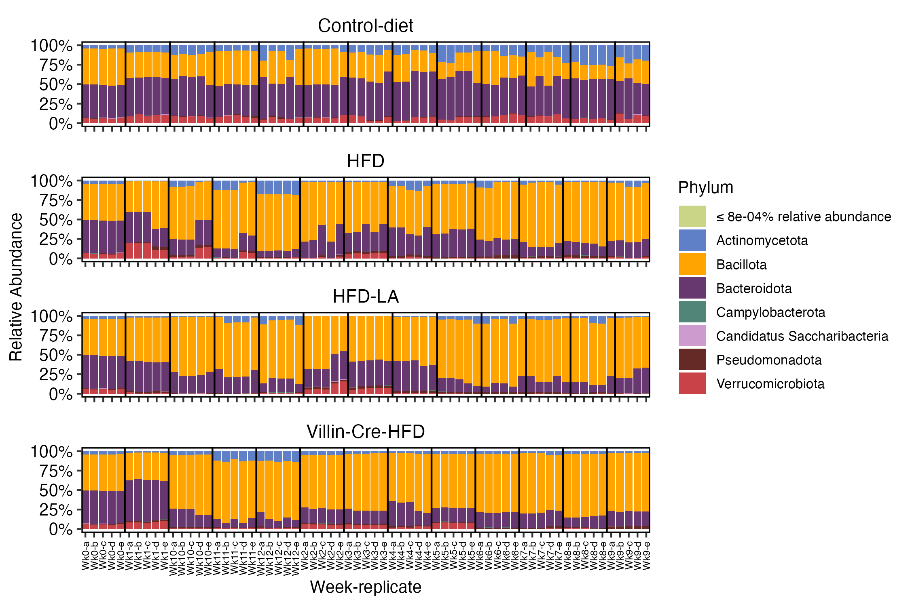
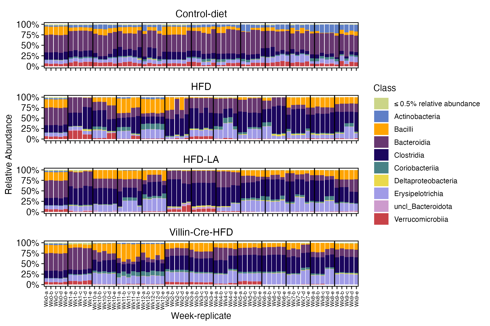
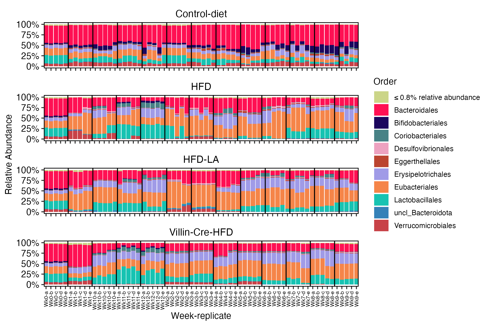
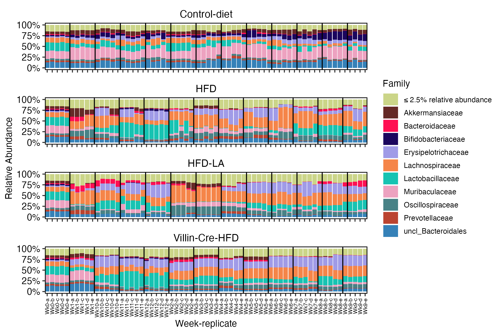
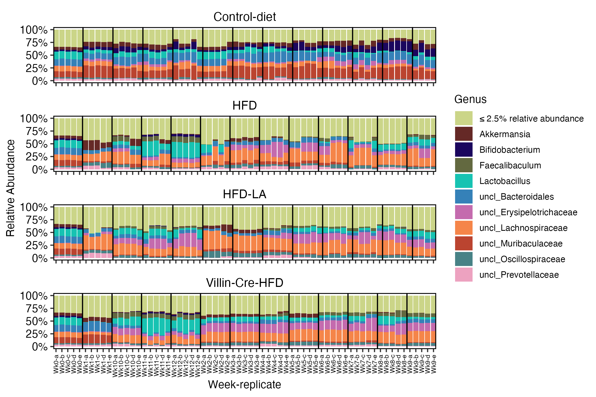

\

::: homelink
<a href="https://kellifeeser.github.io/hfd-microbiome/index.html" target="_blank" style="text-align:right">Back to Home</a>
:::

\

------------------------------------------------------------------------

Document last updated: 2025-04-02

------------------------------------------------------------------------

\

# Set-up {.unlisted .unnumbered .hidden}

## load packages

## load cache

## load rds

# Methods

## DNA extraction and amplicon sequencing

We extracted and sequenced DNA from a total of 245 samples, comprised of 5 random stool samples from before the experimental diets began (referred to as Day 0 or Week 0), while all mice were fed the their standard "Control-diet", and then weekly collections of 5 random stool samples per cohort over the next 12 weeks (5 replicates x 4 cohorts x 12 weeks). DNA extractions were performed using []. Taxonomic profiling was performed by sequencing bacterial 16S rRNA genes. The V3-V4 region of bacterial (and archaeal) 16S rRNA genes was amplified using primers 515f-R806 (Bates et al., 2010). PCR amplifications were performed using previously described methods (Mueller et al., 2016). In the first PCR, sample barcoding was performed with forward and reverse primers each containing a 6-bp barcode; 22 cycles with an annealing temperature of 60oC were performed. The second PCR added Illumina adaptors over 10 cycles with an annealing temperature of 65°C. Amplicon clean-up was performed with a 0.9 ratio of AMPure XP beads (Beckman Coulter, Indianapolis IN), following manufacturer’s instructions and final elutions were performed with 30µl Elution Buffer. Following clean-up, samples were quantified with an Invitrogen Quant-iTTM ds DNA Assay Kit on a BioTek Synergy HI Hybrid Reader and pooled at a concentration of 10 ng per sample. A final clean-up step was performed on pooled samples using a 0.9 ratio of AMPure XP beads. Samples were sequenced on an Illumina MiSeq platform with PE250 chemistry at Los Alamos National Laboratory. Unprocessed sequences are available through NCBI’s Sequence Read Archive ().

## Microbial community sequence analysis

Bacterial and fungal sequences were processed using Usearch11 (Edgar, 2010). Samples were demultiplexed, paired ends merged, quality filtered and globally trimmed using a fastq_maxee threshold of 1.0 (Edgar and Flyvbjerg, 2015), dereplicated, and singletons were removed. Chimeras were removed and 97% OTU clustering was performed independently for the two datasets with the -cluster_otus command using the UPARSE-OTU algorithm (Edgar, 2013). Previous analyses have shown congruent ecological patterns with use of OTUs versus exact sequence variants (ESVs) for delineating microbial taxa (92). OTU tables were created using the -otutab command. Bacterial OTUs were classified using the Ribosomal Database Project (RDP) classifier v.19 (Wang et al., 2007). Next-generation sequencing of 16S rRNA genes resulted in 5,043,233 reads (average of 20,585 ± 3,467 (SD) reads per sample, n = 245 samples). These reads yielded 1,090 OTUs. Domain-level analyses revealed that 99.99% of reads were classified as “Bacteria”, 0.003% as “Eukaryota”, and 0.01% were unclassified at the domain level. The dataset was then filtered to exclude all domains except Bacteria, all reads assigned at \>= 80% confidence at the phylum-level (n = 12,991), reads assigned to the class Chloroplast (n = 122), and the remaining singleton reads (n = 32). We rarefied via subsampling without replacement to 13,006 sequences per sample to account for uneven sequencing depth and from that, 624 bacterial OTUs (97% sequence similarity) were identified from 243 samples.

[Phylum]/[Class]/[Order]/[Family]/[Genus]-level bar plots of the community profiles by week along the 12 week longitudinal can be found in SI Figures XYZ (or here: [Taxonomy].\

## Statistical analysis

Microbial community analyses were conducted primarily in the vegan (Oksanen et al., 2018) and phyloseq (McMurdie and Holmes, 2013) packages in the R programming environment unless otherwise noted. Patterns in microbial community composition were visualized using non-metric multidimensional scaling (NMDS) using Bray-Curtis (abundance-weighted) and Jaccard (binary presence/absence) distance metrics. We investigated the degree to which differences in microbial community profiles were explained by experimental factors .... We also examined differences across initial ...

The statistical significance of these explanatory experimental factors was assessed using adonis2(), a function based on permANOVA, within the vegan R-package (McArdle and Anderson, 2001). Adonis is a permutational (n = 999) multivariate analysis of variance test that partitions our Bray-Curtis distance matrices among sources of variation (Anderson, 2001). The distinctness of the ... communities was assessed using the Random Forests classification algorithm (Breiman, 2001), using 1000 trees. As implemented in the R package ‘randomForest’, the algorithm constructs each tree using a different bootstrap sample from the original data (approximately 1/3 of the cases are left out of the bootstrap sample and not used in the construction of the kth tree), thus providing an unbiased estimate of the test set error without the need for separate cross-validation test.

# Taxonomy {.tabset .tabset-pills}

\

## Phylum {.unnumbered}

{width="110%"}

\

## Class {.unnumbered}

{width="110%"}

\

## Order {.unnumbered}

{width="110%"}

\

## Family {.unnumbered}

{width="110%"}

\

## Genus {.unnumbered}

{width="110%"}

\

#  {.unnumbered}

------------------------------------------------------------------------

# Diversity

\

## Richness (observed species/OTUs)

# subset diets {.unnumbered .unlisted .hidden}

